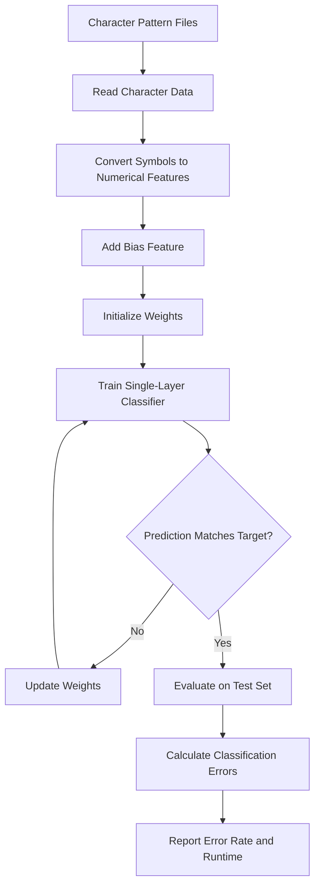

<div align="center">
  
</div>

# Character Pattern Classification with Perceptron and Adaline

This project implements classical single-layer neural learning algorithms for character pattern classification. It explores Perceptron and Adaline learning rules on binary character patterns, evaluates their behavior under noisy inputs, and investigates projection-based feature extraction for reducing the original pattern representation.

<div align="left">

[](https://www.python.org/)
[](https://numpy.org/)
[](#)
[](#)
[](#)
[](#)

</div>

## Abstract

Character recognition provides a simple but effective setting for studying the fundamentals of artificial neural networks and supervised learning. This project implements and compares two classical single-layer learning approaches, Perceptron and Adaline, for classifying binary character patterns.

The implementation uses text-based representations of seven character classes (`A`, `B`, `C`, `D`, `E`, `J`, and `K`). Each character is represented as a fixed binary pattern and augmented with a bias term before being processed by the learning algorithms.

The project further investigates classification under noisy character patterns and introduces a projection-based representation that summarizes the original two-dimensional character patterns through row and column statistics. This provides a practical comparison between direct pixel-level representation and a more compact feature representation.

## Table of Contents

1. [Overview](#-overview)
2. [Key Features](#-key-features)
3. [Learning Methods](#-learning-methods)
4. [Character Representation](#-character-representation)
5. [Classification Workflow](#-classification-workflow)
6. [Noise Handling](#-noise-handling)
7. [Projection-Based Feature Representation](#-projection-based-feature-representation)
8. [Repository Structure](#-repository-structure)
9. [Installation](#-installation)
10. [Running the Project](#-running-the-project)
11. [Technologies Used](#-technologies-used)
12. [Author](#author)

---

# Overview

The project studies supervised character pattern classification using classical neural learning rules rather than modern deep learning architectures.

Seven character categories are used throughout the experiments:

```text
A, B, C, D, E, J, K
```

For each character, three training patterns and three testing patterns are provided. The character patterns are stored as text files containing `#` and `.` symbols, which are converted into numerical feature vectors before training.

The experiments focus on four complementary scenarios:

* Character classification using the Perceptron learning rule
* Character classification using the Adaline (Delta) learning rule
* Perceptron-based classification with noisy character patterns
* Adaline classification using projection-based feature extraction

---

# Key Features

* Implementation of the classical Perceptron learning rule
* Implementation of the Adaline learning rule using the Delta update
* Binary character-pattern representation using text files
* Separate training and testing datasets
* Multi-class classification through one-vs-rest target construction
* Analysis of training updates and classification errors
* Evaluation of Perceptron behavior on noisy patterns
* Majority-based character identification for noisy predictions
* Projection-based feature extraction using row and column statistics
* Configurable initial weights, bias, threshold, and learning rate
* NumPy-based numerical computation
* Runtime and error-rate reporting

---

# Learning Methods

## Perceptron Learning Rule

The Perceptron implementation uses a threshold-based activation function to classify character patterns.

For each target character, the corresponding three samples are assigned a positive target while the remaining samples receive a negative target:

```text
Target vector:

Selected character → +1
Other characters   → -1
```

The weights are updated whenever the current prediction does not match the target. The implementation also tracks the number of weight updates and the number of training iterations required for convergence.

The main implementation is provided in:

```text
1- Perceptron.py
```

---

## Adaline Learning Rule

The Adaline implementation uses an error-driven Delta update to adjust the model parameters.

Unlike the Perceptron implementation, the weight update is based on the difference between the target and the current output:

```text
error = target - output
```

The resulting update is then scaled by the learning rate and the input vector.

The implementation is provided in:

```text
2- Adaline.py
```

---

# Character Representation

The original character patterns are stored as text files using a simple symbolic representation:

```text
# → 1
. → -1
```

Each character pattern is converted into a numerical vector and augmented with a bias feature.

The dataset contains:

```text
Characters:
A, B, C, D, E, J, K

Samples per character:
3 training samples
3 testing samples
```

This produces a compact supervised classification problem suitable for studying the behavior of single-layer neural learning algorithms.

The repository contains two separate directories for the corresponding datasets:

```text
Characters-TrainSet/
Characters-TestSet/
```

---

# Classification Workflow

The overall classification process follows the same general pipeline for the Perceptron and Adaline implementations.



The training process continues until all training predictions match their target values or the predefined update limit is reached.

---

# Noise Handling

## Perceptron with Noisy Character Patterns

A separate implementation investigates the behavior of the Perceptron when character patterns contain noise.

In addition to evaluating the binary output for individual patterns, the implementation counts positive predictions associated with each character group and uses a simple voting mechanism to determine the most likely character.

This provides a basic mechanism for handling ambiguous or corrupted character patterns.

The corresponding implementation is:

```text
3- Perceptron-Noisy data.py
```

The noisy-data experiment demonstrates how a simple single-layer classifier can be extended beyond exact pattern matching toward approximate character recognition.

---

# Projection-Based Feature Representation

## Adaline with Row and Column Projections

The final experiment investigates a more compact representation of the original character patterns.

Instead of directly using all pixel-level values, the character matrix is summarized using:

* Row-wise projections
* Column-wise projections
* Normalization of the resulting feature vector
* A bias feature

The extracted representation combines the row and column statistics into a lower-dimensional feature vector before applying the Adaline learning rule.

Conceptually, the transformation follows:

```text
Original Character Pattern
            │
            ▼
     Row Projections
            │
            ├──────────┐
            │          │
            ▼          ▼
    Column Projections
            │
            ▼
   Feature Concatenation
            │
            ▼
       Normalization
            │
            ▼
        Bias Feature
            │
            ▼
        Adaline Model
```

This experiment provides a comparison between direct pattern representation and feature engineering based on structural properties of the character shapes.

The implementation is provided in:

```text
4- Adaline-Projection.py
```

---

# Repository Structure

```text
Character-Pattern-Classification-with-Perceptron-and-Adaline/
│
├── 1- Perceptron.py
├── 2- Adaline.py
├── 3- Perceptron-Noisy data.py
├── 4- Adaline-Projection.py
│
├── Characters-TrainSet/
│   ├── A1.txt
│   ├── A2.txt
│   ├── A3.txt
│   ├── B1.txt
│   ├── ...
│   └── K3.txt
│
└── Characters-TestSet/
    ├── A1.txt
    ├── A2.txt
    ├── A3.txt
    ├── B1.txt
    ├── ...
    └── K3.txt
```


---

# Installation

## Clone Repository

```bash
git clone https://github.com/ParmidaGh/Character-Pattern-Classification-with-Perceptron-and-Adaline.git

cd Character-Pattern-Classification-with-Perceptron-and-Adaline
```

## Install Dependencies

The project requires Python and NumPy.

```bash
pip install numpy
```

Alternatively, dependencies can be installed through a requirements file if one is added to the repository.

---

# Running the Project

Each experiment is implemented as an independent Python script.

## Perceptron Classification

```bash
python "1- Perceptron.py"
```

## Adaline Classification

```bash
python "2- Adaline.py"
```

## Perceptron with Noisy Data

```bash
python "3- Perceptron-Noisy data.py"
```

## Adaline with Projection Features

```bash
python "4- Adaline-Projection.py"
```

Before execution, the dataset paths inside the scripts should point to the local locations of `Characters-TrainSet` and `Characters-TestSet`.

The main experiments expose the following parameters:

```text
Initial Weight
Bias
Threshold
Learning Rate
```

These parameters can be modified directly in the corresponding `run()` calls to investigate their effect on training behavior and classification performance.

---

# Technologies Used

| Category               | Technology                                         |
|: ---------------------- |: -------------------------------------------------- |
| Programming Language   | Python                                             |
| Numerical Computation  | NumPy                                              |
| Learning Algorithms    | Perceptron, Adaline / Delta Rule                   |
| Pattern Representation | Binary Character Patterns                          |
| Feature Extraction     | Row and Column Projection                          |
| Evaluation             | Classification Error Rate, Weight Updates, Runtime |

---

## Author

**Parmida Ghamari**
M.Sc. in Information Technology, University of Tehran

**Research Interests:** Machine Learning, Neural Networks, Deep Learning, Pattern Recognition, Representation Learning, Graph Machine Learning, Natural Language Processing, and Artificial Intelligence

📧 [Parmida.ghamari@gmail.com](mailto:Parmida.ghamari@gmail.com)
💻 [github.com/ParmidaGh](https://github.com/ParmidaGh)
💼 [linkedin.com/in/parmida-ghamari](https://www.linkedin.com/in/parmida-ghamari)

---

<p align="center">
  Built with NumPy and Python
</p>
